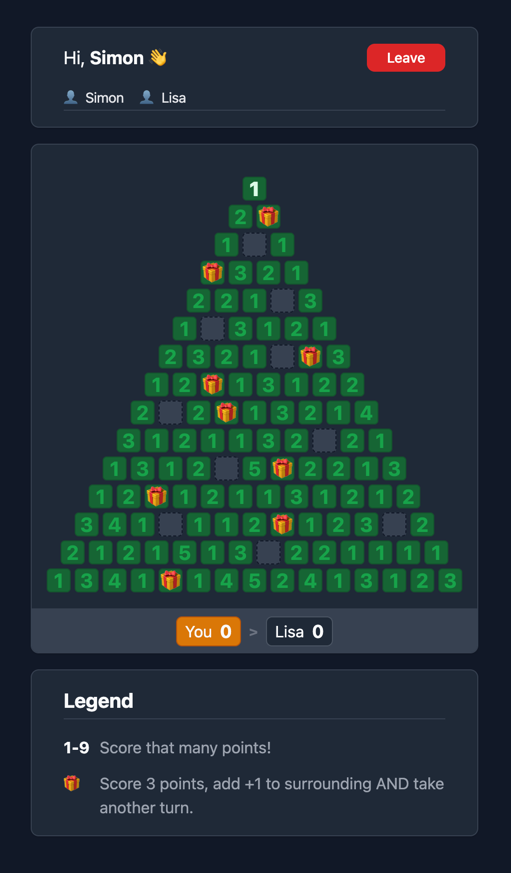
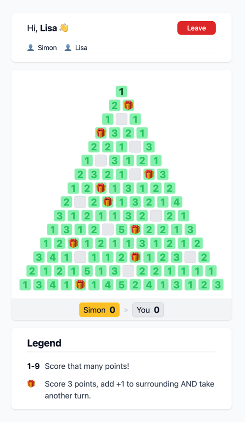

# Christmas Tree
A Christmas themed game build with [Krmx](https://simonkarman.github.io/krmx).

## Getting started
First run `npm install` in the root of this repository.

Then, run `npm run dev` to start the system, server and client in development mode.

Now you can open the application on your local machine on `http://localhost:3000`.

## Light and dark themes
Based on the browser or device setting the dark or light theme is used.

You can find more images in the `docs/` directory of this repository.

## Contributing
If you would like to contribute to this repository then pease create a pull request or [open an issue](https://github.com/simonkarman/christmas-tree/issues).

If you would like to contribute to the underlying networking protocol for realtime multi-user interactions, then please take a look at: [Krmx - Documentation](https://simonkarman.github.io/krmx).

### Contributors
- [Simon Karman](https://www.simonkarman.nl) - *creator of Krmx*
- [Lisa Pruijn](https://www.lisapruijn.nl) - *game design and tester*
